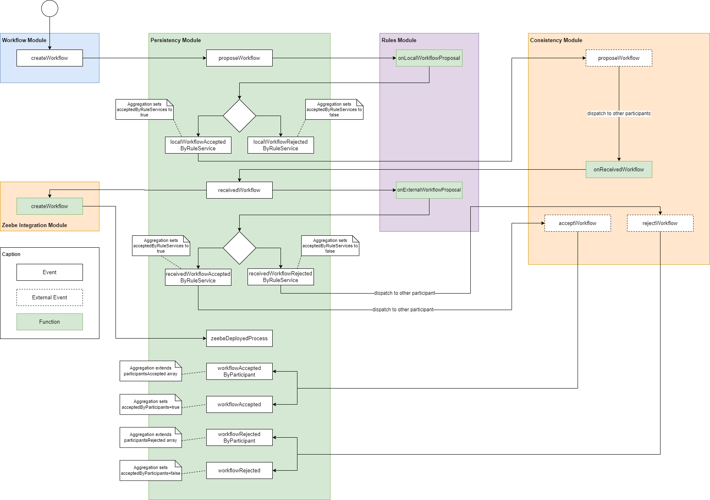
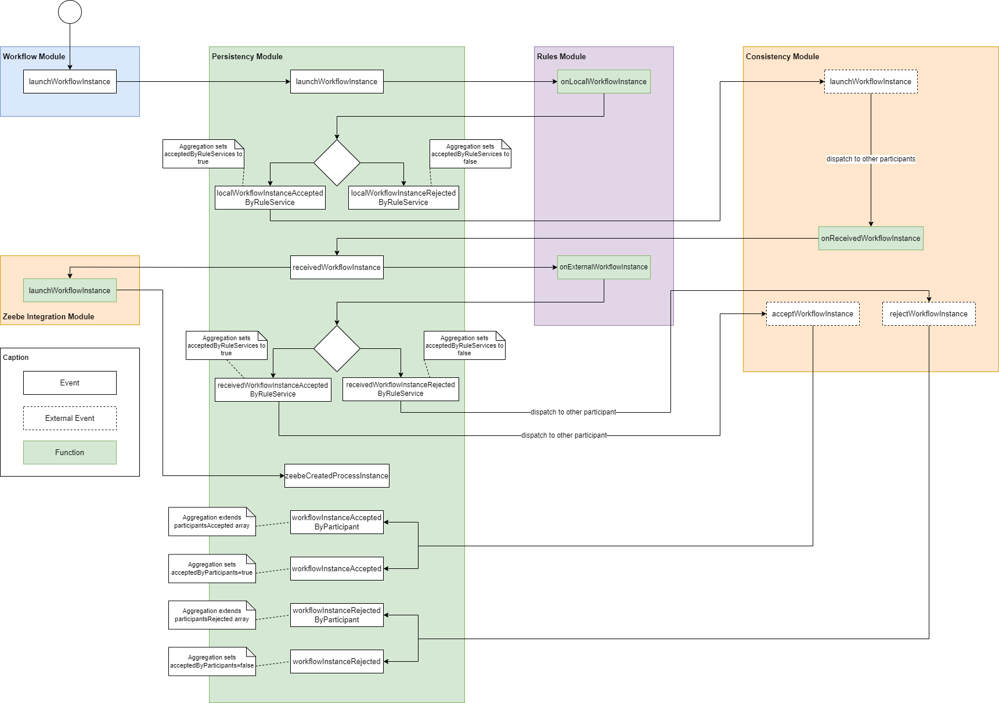
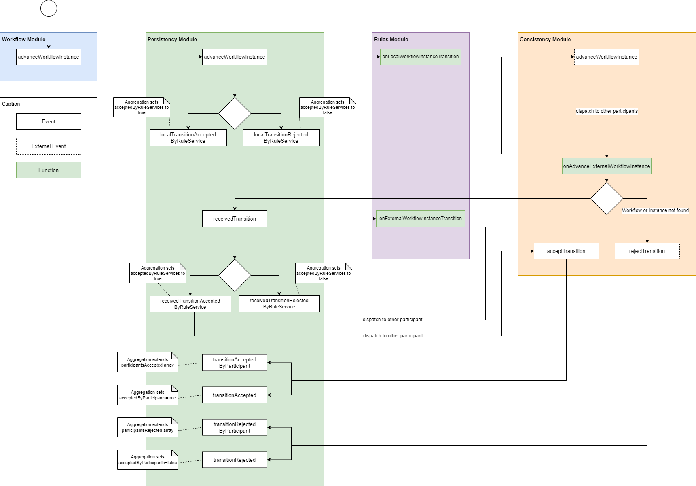
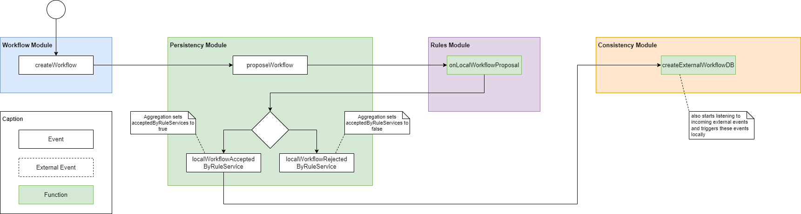
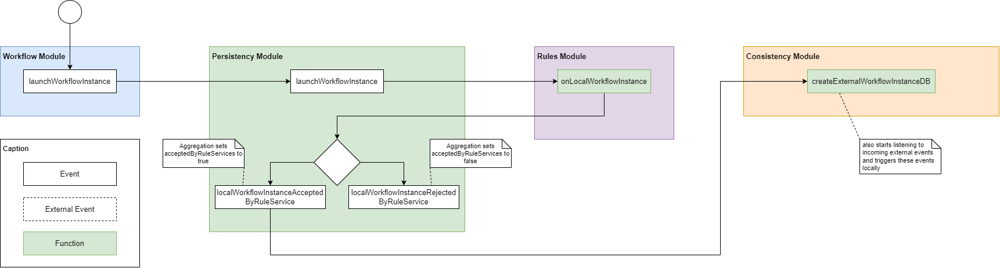
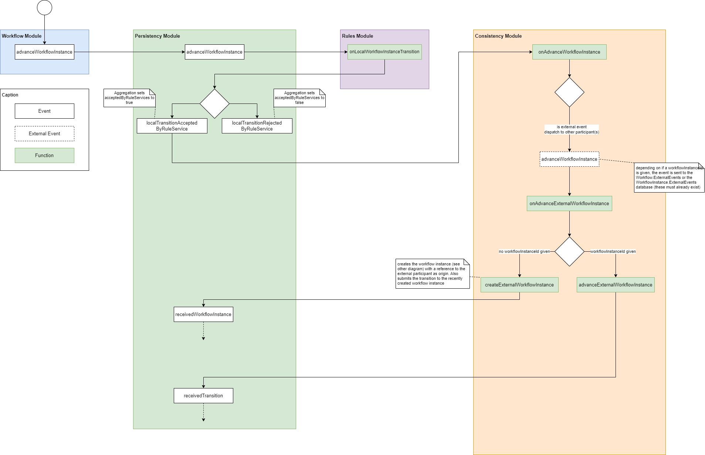
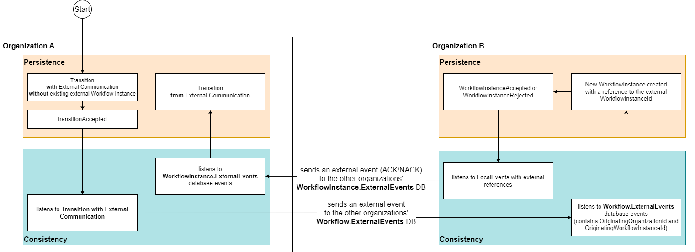

# Persistency Module
## Persistence Service Interface
### Propose a Workflow
* `proposeWorkflow(proposal)`
* When creating a new workflow, it must get accepted by all participants / peers.
* used by `WorkflowService` which gets called via the Workflow modules' REST endpoint

### Dispatch a Workflow Event
* `dispatchWorkflowEvent(id, event)`
* Dispatches an event concerning the specification / proposal of a workflow
* Mostly just concerning the response to a proposal or when receiving a workflow from another participant
* used by `ConsistencyService` and `RulesService`
* **Events:**
  * WorkflowAcceptedByParticipant
  * WorkflowAccepted - by all participants
  * WorkflowRejectedByParticpant
  * WorkflowRejected - by at least one participant
  * ReceivedWorkflow
  * ReceivedWorkflowAcceptedByRuleService
  * ReceivedWorkflowRejectedByRuleService
  * LocalWorkflowAcceptedByRuleService
  * LocalWorkflowRejectedByRuleService

### Dispatch a Workflow Instance Event
* `dispatchInstanceEvent(id, event)`
* Dispatches an event concerning a specific workflow instance
* used by `ConsistencyService` and `RulesService`
* **Events:**
  * ReceivedTransition
  * TransitionAcceptedByParticipant
  * TransitionAccepted
  * WorkflowInstanceAcceptedByParticipant
  * WorkflowInstanceAccepted
  * TransitionRejectedByParticipant
  * TransitionRejected
  * WorkflowInstanceRejectedByParticipant
  * WorkflowInstanceRejected
  * ReceivedWorkflowInstance
  * ReceivedTransactionAcceptedByRuleService
  * ReceivedTransitionRejectedByRuleService
  * ReceivedWorkflowInstanceAcceptedByRuleService
  * ReceivedWorkflowInstanceRejectedByRuleService
  * LocalTransitionAcceptedByRuleService
  * LocalTransitionRejectedByRuleService
  * LocalWorkflowInstanceAcceptedByRuleService
  * LocalWorkflowInstanceRejectedByRuleService

### Dispatch a Rules Event
* `dispatchRulesEvent(id, event)`
* Dispatches an event concerning the specification of rule services
* used by `RulesService` where it gets called by the `RulesController`
* **Events:**
  * RegisterRuleService
  * UnregisterRuleService

### Dispatch an arbitrary Event
* `dispatchEvent(streamName, event)`
* Dispatches an arbitrary event to a given stream
* used by `ZeebeService`
* **Events:**
  * zeebeDeployedProcess gets dispatched when we receive a `ReceivedWorkflow` event
  * zeebeCreatedProcessInstance gets dispatched when we receive a `ReceivedWorkflowInstance` event

### Launch a Workflow Instance
* `launchWorkflowInstance(workflowInstanceProposal)`
* dispatches a `LaunchWorkflowInstance` event to the corresponding instance event stream
* used by `WorkflowService` where it gets called by the `WorkflowController`

### Advance the State of a Workflow Instance
* `advancedWorkflowInstanceState(workflowInstanceTransition)`
* dispatches a `AdvanceWorkflowInstance` event to the corresponding instance event stream
* used by `WorkflowService` where it gets called by the `WorkflowController` and the `ZeebeService`

### Get the State of a Workflow at a specific Date
* `getWorkflowStateAt(id, date)`
* aggregates all related events up to the given date and returns the resulting workflow object
* used by `WorkflowService` where it gets called by the `WorkflowController`

### Get the State of a Workflow Instance at a specific Date
* `getWorkflowInstanceStateAt(id, date)`
* aggregates all related events up to the given date and returns the resulting workflow instance object
* used by `WorkflowService` where it gets called by the `WorkflowController`

### Get all Payloads attached to a Workflow Instance Transition up to a specific Date
* `getWorkflowInstanceStateTransitionPayloadsUntil(id, until)`
* iterates through all transition events and yields all events as an array
* used by `WorkflowService` where it gets called by the `WorkflowController`

### Get Workflow by Id
* `getWorkflowById(id)`
* used by `ConsistencyService` when some external participant advanced a specific workflow (which triggers the rule service)
* used by `WorkflowService` for different functions to get the Workflow and the associated Workflow Model

### Get a Workflow Instance by Id
* `getWorkflowInstanceById(instanceId)`
* aggregates all Workflow Instances in the Database via an event sourcing projection (DB-defined) and returns the one with the given Id
* <mark>Inefficient implementation?</mark>
* used by `ConsistencyService` when some external participant advanced a specific workflow (which triggers the rule service)
* used by the `WorkflowService` to advance a workflow and to return the workflow instance to the controller

### Get All Workflow Instances of a Given Workflow
* `getWorkflowInstancesOfWorkflow(workflowId)`
* executes `getWorkflowInstanceById` and returns all aggregated workflow instances that belong to the given workflow Id
* used by `WorkflowService` where it gets called by the `WorkflowController`

### Get All Workflows
* `getAllWorkflows()`
* aggregates all workflows via a DB-side projection and returns them
* used by `WorkflowService` where it gets called by the `WorkflowController`

### Get a Projection Result from the Event Source DB
* `getProjectionResult(projectionName, options)`
* executes a DB-sided projection and returns the result
* currently only used by the Zeebe integration to execute a custom defined Zeebe projection
* <mark>Check if we even need custom projections as OrbitDB doesn't support that</mark>

### Get Registered Rule Service by Id
* `getRegisteredRuleServiceById(id)`
* stores all registered rule services in an event-log form
* aggregates all (un-)registration events and returns the result (just the aggregated result of the given rule service id)
* <mark>Should possibly be moved somewhere else?</mark>
* used by the `RuleService` to check if a specific rule service exists when unregistering one

### Get All Registered Rule Services
* `getAllRegisteredRuleServices()`
* aggregates all rule service (un-)registration events and returns all of the aggregated rule services
* used by the `RuleService` where it gets called by the controller
* used by the `RuleService` to iterate over all registered rule services and call them for validation

### Add an arbitrary event to a stream
* `appendToStream(streamName, event)`
* only used by the `PersistenceService`
* <mark>Why is this public? Can be private</mark>

### Read a specified Event Stream from the DB
* `readStream(streamName)`
* only used by the `PersistenceService`
* <mark>Why is this public? Can be private</mark>

### Check if a Projection exists in the DB
* `existsProjection(projectionName)`
* used by `PersistenceService` and the `ZeebeService`

### Create a Projection on the DB
* `createProjection(projectionName, query, options)`
* used by the `ZeebeService`

### Disable a Projection on the DB
* `disableProjection(projectionName, options)`
* used by the `ZeebeService`

### Delete a Projection on the DB
* `deleteProjection(projectionName, options)`
* used by the `ZeebeService`

### Subscribe to all Events in the DB
* `subscribeToAll(eventHandler)`
* subscribes to all events that are dispatched to the DB
* Volatile => no past events are emitted, only events that happened after the subscription through this method.
* used by the `ConsistencyService`, `RulesService` and `ZeebeService`

## Data Flow Old
### Create Workflow

### Launch Workflow Instance

### Advance Workflow Instance

## Data Flow Refactored (v2)
**Version 2:**
* without Zeebe integration

### Create Workflow

### Launch Workflow Instance

### Advance Workflow Instance

### External Events: Launch External Workflow Instance

### External Events: Advance External Workflow Instance

### TODO
* think about still having participants and the acceptance mechanisms from the old prototype => maybe it's not that much work
  * we would still need authorization in the participants (don't just extend the participantsAccepted array but rather add the source participant depending on the event)
  * also think about starting simple without participants and adding that mechanism later (if there's time)
  * should we still use the point-2-point strategy or also use OrbitDB for participants (participants in the context of the old prototype, not external participants/organizations)
* Wouldn't a per-instance local configuration of the rule services fit better than storing them in EventStore DB?
  * Or what's the reason then for storing them in the EventStore DB and having controllers for managing them?

## FAQ
### Why are sometimes db-sided projections and sometimes client side projections used
  * the EventSource DB doesn't support stopping the aggregation at a given point in time
  * In that case the aggregation must be done client-side